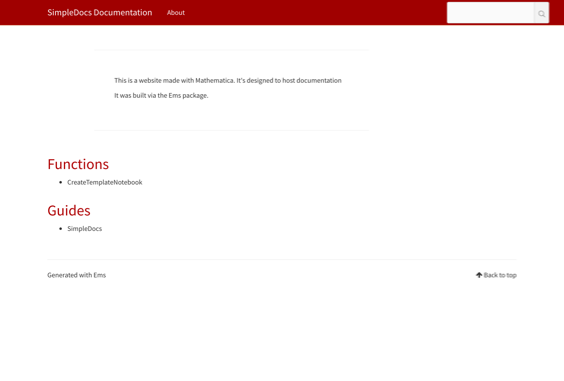

Title: BuildDocsSite
built: {2018, 11, 23, 23, 45, 26.201132}
context: SimpleDocs`
Date: 2018-11-24 01:59:44
history: 11.3,,
index: True
keywords: <||>
label: BuildDocsSite
language: en
Modified: 2018-11-24 01:59:49
paclet: Mathematica
specialkeywords: <||>
status: None
summary: 
synonyms: <||>
tabletags: <||>
title: BuildDocsSite
titlemodifier: 
tutorialcollectionlinks: <||>
type: Symbol
uri: SimpleDocs/ref/BuildDocsSite
windowtitle: BuildDocsSite

<a id="builddocssite" style="width:0;height:0;margin:0;padding:0;">&zwnj;</a>

# BuildDocsSite

    BuildDocsSite[pac]

builds a docs website for the paclet  *pac*

<a id="details" style="width:0;height:0;margin:0;padding:0;">&zwnj;</a>

## Details

* ```BuildDocsSite``` is basically just an alias for  [```Ems```](../ref/Ems.html) but with a bit of logic for turning  *pac* into the right thing.

<a id="examples" style="width:0;height:0;margin:0;padding:0;">&zwnj;</a>

## Examples

### Basic Examples

Load the package:

    Needs["SimpleDocs`Package`"]

Build the documentation website for SimpleDocs:

    BuildDocsSite["SimpleDocs"]

    (*Out:*)
    
    "~/Documents/Wolfram Mathematica/Applications/SimpleDocs/project/docs/output"

We can have that open, too, using BTools (which is loaded by SimpleDocs)

    BTools`External`PySimpleServerOpen@%



<a id="see-also" style="width:0;height:0;margin:0;padding:0;">&zwnj;</a>

## See Also

[```BuildDocsSite```](../ref/BuildDocsSite.html) |  [```BuildNotebookDocsSite```](../ref/BuildNotebookDocsSite.html) |  [```CreateTemplateNotebook```](../ref/CreateTemplateNotebook.html) |  [```InitializeDocsSite```](../ref/InitializeDocsSite.html) |  [```OpenDocsSiteConfig```](../ref/OpenDocsSiteConfig.html) |  [```SampleTemplateNotebook```](../ref/SampleTemplateNotebook.html) |  [```SaveNotebookMarkdown```](../ref/SaveNotebookMarkdown.html) |  [```SaveNotebookToPaclet```](../ref/SaveNotebookToPaclet.html) |  [```SaveNotebookToPacletProject```](../ref/SaveNotebookToPacletProject.html) |  [```SetNotebookPaclet```](../ref/SetNotebookPaclet.html) |  [```$DockedCell```](../ref/%24DockedCell.html) |  [```$HamburgerMenu```](../ref/%24HamburgerMenu.html) |  [```$InsertionMenu```](../ref/%24InsertionMenu.html) |  [```$MetadataEditor```](../ref/%24MetadataEditor.html) |  [```$NotebookTemplates```](../ref/%24NotebookTemplates.html)

<a id="related-guides" style="width:0;height:0;margin:0;padding:0;">&zwnj;</a>

## Related Guides

* [SimpleDocs](../guide/SimpleDocs.html)

<a id="related-tutorials" style="width:0;height:0;margin:0;padding:0;">&zwnj;</a>

## Related Tutorials

* [SimpleDocs](../tutorial/SimpleDocs.html)

<a id="related-links" style="width:0;height:0;margin:0;padding:0;">&zwnj;</a>

## Related Links

* [SimpleDocs](https://github.com/b3m2a1/SimpleDocs)

* [BTools](https://github.com/b3m2a1/mathematica-BTools)

* [Ems](https://github.com/b3m2a1/Ems)

---

Made with  [SimpleDocs](https://github.com/b3m2a1/SimpleDocs)