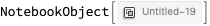
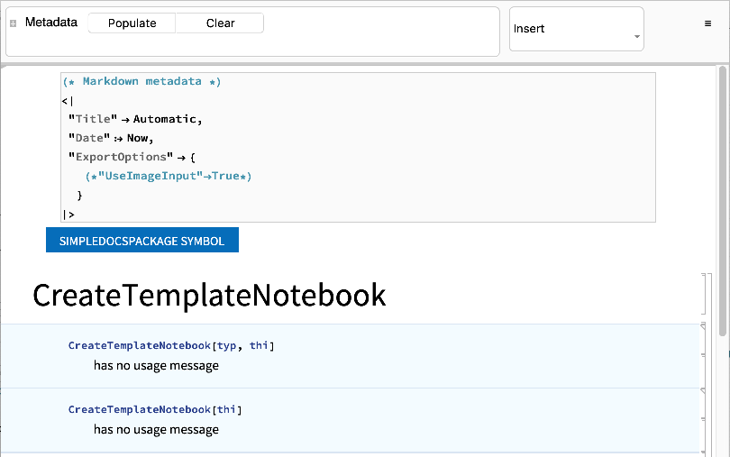
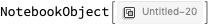
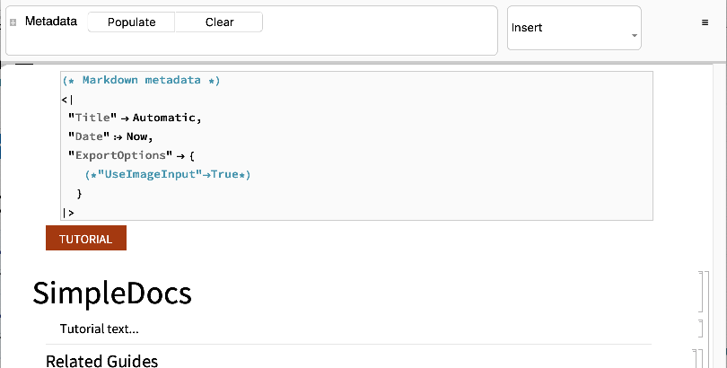

Title: CreateTemplateNotebook
built: {2018, 11, 22, 14, 7, 16.560213}
context: SimpleDocs`Package`
Date: 2018-11-23 22:34:08
history: 11.3,,
index: True
keywords: <||>
label: CreateTemplateNotebook
language: en
Modified: 2018-11-23 22:34:09
paclet: Mathematica
specialkeywords: <||>
status: None
summary: 
synonyms: <||>
tabletags: <||>
title: CreateTemplateNotebook
titlemodifier: 
tutorialcollectionlinks: <||>
type: Symbol
uri: SimpleDocs/ref/CreateTemplateNotebook
windowtitle: CreateTemplateNotebook
WorkflowDockedCell: 

<a id="createtemplatenotebook" style="width:0;height:0;margin:0;padding:0;">&zwnj;</a>

# CreateTemplateNotebook

    CreateTemplateNotebook[type, thing]

creates a template notebook of type  ```type``` for object  ```thing```

<a id="details" style="width:0;height:0;margin:0;padding:0;">&zwnj;</a>

## Details

* ```type``` can be  ```"Tutorial"``` ,  ```"Symbol"``` , or  ```"Guide"```

* For a  ```"Symbol"``` ,  ```thing``` should be a symbol; for a  ```"Tutorial"``` or  ```"Guide"``` ,  ```thing``` should be a string

<a id="examples" style="width:0;height:0;margin:0;padding:0;">&zwnj;</a>

## Examples

### Basic Examples

Load the package:

    Needs["SimpleDocs`Package`"]

Create a template notebook for  ```CreateTemplateNotebook```

    CreateTemplateNotebook["Symbol", CreateTemplateNotebook]

    (*Out:*)
    




Create a template notebook for the SimpleDocs tutorial:

    CreateTemplateNotebook["Tutorial", "SimpleDocs"]

    (*Out:*)
    




<a id="see-also" style="width:0;height:0;margin:0;padding:0;">&zwnj;</a>

## See Also

[```BuildDocsSite```](../ref/BuildDocsSite.html) |  [```BuildNotebookDocsSite```](../ref/BuildNotebookDocsSite.html) |  [```CreateTemplateNotebook```](../ref/CreateTemplateNotebook.html) |  [```InitializeDocsSite```](../ref/InitializeDocsSite.html) |  [```OpenDocsSiteConfig```](../ref/OpenDocsSiteConfig.html) |  [```SampleTemplateNotebook```](../ref/SampleTemplateNotebook.html) |  [```SaveNotebookMarkdown```](../ref/SaveNotebookMarkdown.html) |  [```SaveNotebookToPaclet```](../ref/SaveNotebookToPaclet.html) |  [```SaveNotebookToPacletProject```](../ref/SaveNotebookToPacletProject.html) |  [```SetNotebookPaclet```](../ref/SetNotebookPaclet.html) |  [```$DockedCell```](../ref/%24DockedCell.html) |  [```$HamburgerMenu```](../ref/%24HamburgerMenu.html) |  [```$InsertionMenu```](../ref/%24InsertionMenu.html) |  [```$MetadataEditor```](../ref/%24MetadataEditor.html) |  [```$NotebookTemplates```](../ref/%24NotebookTemplates.html)

<a id="related-guides" style="width:0;height:0;margin:0;padding:0;">&zwnj;</a>

## Related Guides

* [SimpleDocs](../guide/SimpleDocs.html)

<a id="related-links" style="width:0;height:0;margin:0;padding:0;">&zwnj;</a>

## Related Links

* [SimpleDocs](https://github.com/b3m2a1/SimpleDocs)

* [BTools](https://github.com/b3m2a1/mathematica-BTools)

* [Ems](https://github.com/b3m2a1/Ems)

---

Made with  [SimpleDocs](https://github.com/b3m2a1/SimpleDocs)