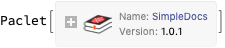
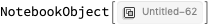
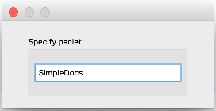
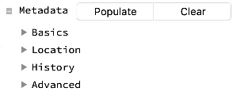
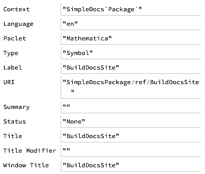
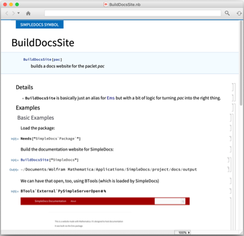
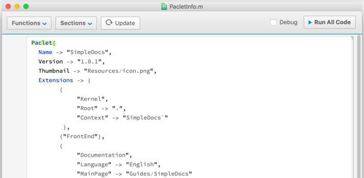
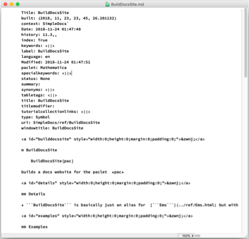
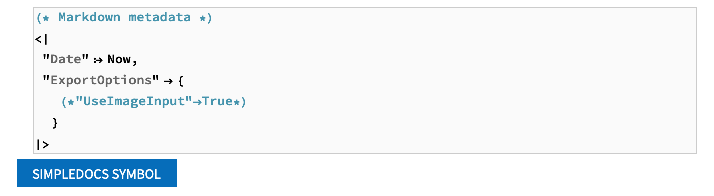

Title: SampleTutorial
built: {2018, 11, 23, 23, 23, 54.214811}
context: SimpleDocs`
Date: 2018-11-24 01:55:10
history: 11.3,,
index: True
keywords: <||>
label: SampleTutorial
language: en
Modified: 2018-11-24 01:55:16
paclet: Mathematica
specialkeywords: <||>
status: None
summary: 
synonyms: <||>
tabletags: <||>
title: SampleTutorial
titlemodifier: 
tutorialcollectionlinks: <||>
type: Tutorial
uri: SimpleDocs/tutorial/SampleTutorial
windowtitle: SampleTutorial

<a id="simpledocs-usage" style="width:0;height:0;margin:0;padding:0;">&zwnj;</a>

# SimpleDocs Usage

SimpleDocs package can't do crazy things. It won't make the most interactive and beautiful docs you could ever want. What it  *can* do is make simple documentation that can be nicely converted to other platforms and is more than adequate for 90% of cases.

As an example, we'll write documentation for the simple docs package here, demonstrating the full extent of its limited features.

First let's install the package, if it's not installed already:

<a id="installing-the-package" style="width:0;height:0;margin:0;padding:0;">&zwnj;</a>

## Installing the Package

    Needs["PacletManager`"]
    PacletInstall["SimpleDocs",
       "Site" -> 
      "http://www.wolframcloud.com/objects/b3m2a1.paclets/PacletServer"
       ]

    (*Out:*)
    


<a id="creating-function-templates" style="width:0;height:0;margin:0;padding:0;">&zwnj;</a>

## Creating Function Templates

Next we'll create some templates for the functions in the package. First we get the functions:

    << SimpleDocs`Package`
    fns = Names["SimpleDocs`Package`*"]

    (*Out:*)
    
    {"BuildDocsSite","BuildNotebookDocsSite","CreateTemplateNotebook","InitializeDocsSite","OpenDocsSiteConfig","SampleTemplateNotebook","SaveNotebookMarkdown","SaveNotebookToPaclet","SaveNotebookToPacletProject","SetNotebookPaclet","$DockedCell","$HamburgerMenu","$InsertionMenu","$MetadataEditor","$NotebookTemplates"}

Then we use  [```CreateTemplateNotebook```](../ref/CreateTemplateNotebook.html) to make templates for these. To start we'll just make a template for the first one or something:

    CreateTemplateNotebook@First@fns

    (*Out:*)
    



<a id="building-function-documentation" style="width:0;height:0;margin:0;padding:0;">&zwnj;</a>

## Building Function Documentation

At this point we have a template notebook to work with. Before we go on with anything we'll probably want to save this to our as a template. The place SimpleDocs saves these is to a subfolder of a paclet. It can be saved anywhere, but by using the SimpleDocs code we can get a website out automatically. The way to do this is to go to the hamburger menu in the top-right corner (incidentally this is called  ```$HamburgerMenu``` in the package) and to the  *Save To Project* item there. This'll pop up a little dialog:



Just press Enter and it'll save to a project subfolder of the paclet and will also initialize content necessary to build the website later.

### Metadata

Next notice the thing in the  [```DockedCell```](../ref/DockedCells.html) that says  *Metadata* . This is stuff we should edit to help Mathematica do stuff with the docs finding. This thing works as a cascade of menus and  [```InputFields```](../ref/InputField.html) that we play with. It's also just the  ```$MetadataEditor``` object in the package:

    $MetadataEditor



The biggest thing to edit is the  *Basics* menu. Here's a look at that:

    $MetadataEditor[[2, 1, 1, 2, 2, 2, 1, 1, 1, 2]]



The big thing to change here is the  ```"URI"``` . We'd rather have this be  ```"SimpleDocs/ref/BuildDocsSite"``` , so that Mathematica can find that URI. The  ```"Context"``` might need to edited to be in line with this, too, but I'm not sure.

We have many other types of metadata to fill, too, especially in the  *Location* tab, which help Mathematica locate the documentation notebook.

### Usage/Details/Examples

We also have some things to edit in the documentation body itself. One quick thing is we'll probably want to change that  ```SIMPLEDOCSPACKAGE SYMBOL``` to  ```SIMPLEDOCS SYMBOL``` to be consistent with how we're thinking about this.

Next, we basically just type what we want. For the usage, we just type a usage message or a function declaration, as we see fit. If we want to add more sections we just copy the previous two or go to  *Insert » Usage* in the docked cell and it'll make a template for us to fill out, too.

For the details, there are a few little things set, but for the most part we just add new  ```"Item"``` cells and type. Honestly pretty much any cell will work, but in the name of simplicity and extensibility grids should be done as cascades of,  ```"Item"``` ,   ```"Subitem"``` and  ```"Subsubitem"``` cells.

Examples work similarly, where we can just write things and evaluate and all will work as expected. The one thing to be careful with it that we should be sure to add a call in to  [```Needs```](../ref/Needs.html) for the package at hand so that all the code will work as expected.

### See Also/Related Sections

In general it's hard to figure out what things to relate, so there aren't really any related things that may be autofilled. There may sometimes be a few functions filled out, but that's pretty much it.

With these sections there are only a few things to be careful with. First off, when there will be lots of related things (as with functions) I tend to use | as the separator between items. Secondly, when working with these, we'll want to use two different types of links. 

#### Function/Guide/Tutorial Links

For any content that references piece of docs within the paclet or in another paclet (or in the system docs), we use a special type of link that looks like  ```"paclet:PkgName/type/ContentName"``` . This is also how the  ```"URI"``` in the metadata should look.  ```type``` will be any of  ```"ref"``` ,  ```"guide"``` , or  ```"tutorial"``` , the  ```"PkgName"``` will be dropped altogether if the context is  ```"System`"``` .

#### External Links

These links are normal links. It probably makes sense to collect a set of links with the first page of docs and copy these over

### Saving to Paclet

We save the documentation from the hamburger menu by going to  *Save Documentation* . This will ensure the metadata is there, change the notebook mode to working instead of editing, and save to the approrpriate location in the paclet we said the notebook was part of initially. After we do that it mostly looks like normal docs:



Next we add the necessary things to the  ```"PacletInfo.m" ``` file by using the  *Update PacletInfo* menu item:



We only really need to do this once (or whenever we add new things to the paclet that we want to be accounted for here).

At this point, once the documentation indices get rebuilt (not entirely sure what this takes) we should be able to find our new function via search.

<a id="markdown-and-websites" style="width:0;height:0;margin:0;padding:0;">&zwnj;</a>

## Markdown and Websites

At this point we can also do things to get a website out of our notebook. The key benefit of the simplistic nature of these docs pages is it's possible to directly map them over to other formats. The "intermediate representation" we'll use here is called  [Markdown](https://daringfireball.net/projects/markdown/syntax) and is a popular format these days for representing documents. Many sites process it naturally, including  [GitHub](https://github.com/) ,  [StackExchange](https://mathematica.stackexchange.com/) , and many others. Lots of documentation systems (e.g.  [sphinx](http://www.sphinx-doc.org/en/master/) ) use Markdown as their base content, too.

### Markdown Export

As far as what we'll need to do, we can simply use the  *Save to Markdown* menu item and it will save the Markdown automatically, exporting any images, links, etc. as we need them.



One big thing is, absent any type of specializations,  **be certain that images aren't in Input/Code cells** . Input exports as a plain-text representation by default and the box structures can become huge and slow everything down. Images in any other type of cells are fine.

#### Customization

On the topic of customization, we finally come to the a cell I ignored up at the top, which is that cell that says "Markdown metadata"



This is a cell where we can add special parameters to the Markdown. This might be flags to be used within the website export process, or, as is commented out, whether to use images for all input as is done in the standard web documentation.

The listing of options is extensive and will depend on the use case, and we'll get into that in other tutorials

### Building the Website

The last thing to do, after we've amassed our content, is to build the actual website. Amusingly, the function we've been documenting,  ```BuildDocsSite``` , is the function used for this export process too. All we do though is go to the  *Build Site* menu item and the site will be built for us automatically:

---

<a id="related-guides" style="width:0;height:0;margin:0;padding:0;">&zwnj;</a>

## Related Guides

* [SimpleDocs](../guide/SimpleDocs.html)

<a id="related-links" style="width:0;height:0;margin:0;padding:0;">&zwnj;</a>

## Related Links

* [SimpleDocs](https://github.com/b3m2a1/SimpleDocs)

* [BTools](https://github.com/b3m2a1/mathematica-BTools)

* [Ems](https://github.com/b3m2a1/Ems)

---

Made with  [SimpleDocs](https://github.com/b3m2a1/SimpleDocs)